# User Guide
Duke is a **desktop application for managing and keeping track of tasks,
optimised for use via a Command Line Interface** (CLI).
As Duke is a CLI application, it can help you manage your tasks much faster if you can type fast.

---

## Quick Start
1. Ensure that you have `Java 11` or above installed on your computer.
2. Download the latest release of `Warren's version of Duke` from Github [here](https://github.com/warrencxw/ip/releases).
3. Copy the file to a folder that you want to use as the _home folder_ for the application.
   Do note that a new folder `data` would be created in the same folder,
   along with the save file `save.csv` within that folder, to save all your tasks.
4. Open your command line interface or terminal _(e.g. `cmd`)_ and change the working directory to the _home folder_.
5. Run the program by using the command `java -jar ip.jar`. An interface similar to the one below should appear. 
   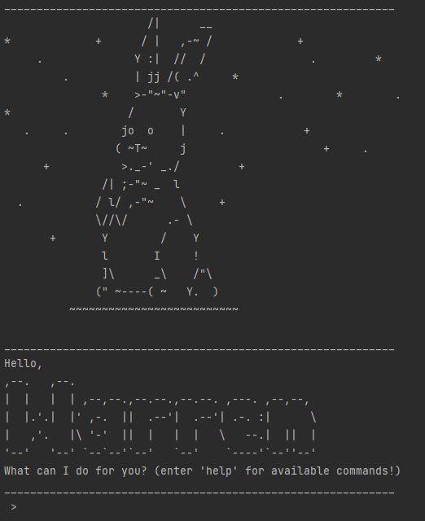
6. Type any commands you would like and press the _enter_ key to execute the command.
   The following are some examples to start using the application.
   - `help`: Lists all the commands available in the application.
   - `list`: Lists all saved tasks.
   - `deadline Homework /by 2022-03-04`: Adds a task named "Homework" with a due date of 4 March 2022.
   - `mark 1`: Marks the first task in the list as complete.
- You may refer to [Features](#features) below for a list of all the commands and their details.

---

## Features 
> **Notes regarding the command format:**
> - Words in `<ANGLE BRACKETS>` are parameters to be supplied by the user 
>   e.g. in `find <SUBSTRING>`, `<SUBSTRING>` is a parameter which can be replaced as in `find coding assignment`.
> - Parameters, when given to commands that do not accept parameters (e.g. `list`, `help`) will be ignored. 
>   e.g. an input of `list apple` will be interpreted as just `list`
> - Aliases are alternative ways to perform the same command, and can be used to replace the command word.
> - Commas are ***not*** allowed to be used in any of the parameters.
### List of Features
- [Listing all tasks](#listing-all-tasks--list) `list`
- [Displaying the help menu](#displaying-the-help-menu--help) `help`
- [Creating a todo task](#creating-a-simple-todo-task--todo) `todo`
- [Creating an event task](#creating-an-event-task--event) `event`
- [Creating a deadline task](#creating-a-deadline-task--deadline) `deadline`
- [Marking a task as complete](#marking-a-task-as-complete--mark) `mark`
- [Marking a task as incomplete](#marking-a-task-as-incomplete--unmark) `unmark`
- [Finding a task](#finding-a-task-by-searching-with-substring--find) `find`
- [Displaying help menu](#displaying-the-help-menu--help) `help`
- [Deleting a task](#deleting-a-single-task--delete) `delete`
- [Clearing all tasks](#clearing-all-tasks--clear) `clear`
- [Exiting the application](#exiting-the-application--bye) `bye`
- [Saving data](#saving-data)
- [Loading data](#loading-data)
- [Editing the save file](#editing-the-save-file)

---

### Listing all tasks : `list`
Shows a list of all tasks saved in the application.
#### Format: `list`
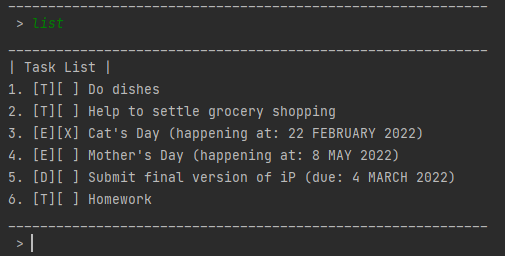

### Creating a simple todo task : `todo`
Creates a simple todo task and adds it into the application.
#### Format: `todo <DESCRIPTION>`
#### Examples
- `todo Do dishes`
- `todo Help to settle grocery shopping` 
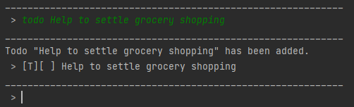

### Creating an event task : `event`
Creates an event entry that occurs at a specific date.
#### Format: `event <DESCRIPTION> /at <DATE>`
- Note that `<DATE>` must be a valid date in the format `YYYY-MM-DD`, 
  where `February 22, 2022` would be represented as `2022-02-22`
#### Examples
- `event Cat's Day /at 2022-02-22`
- `event Mother's Day /at 2022-05-08` 
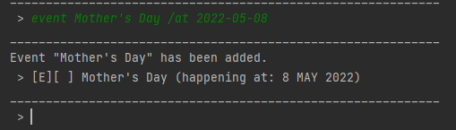

### Creating a deadline task : `deadline`
Creates a task with a specified deadline by a specific date.
#### Format: `deadline <DESCRIPTION> /by <DATE>`
- Note that `<DATE>` must be a valid date in the format `YYYY-MM-DD`,
  where `February 22, 2022` would be represented as `2022-02-22`
#### Examples
- `deadline Submit assignment /by 2022-03-08`
- `deadline Submit final version of iP /by 2022-03-04` 
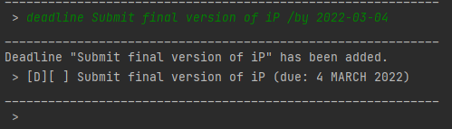

### Marking a task as complete : `mark`
Marks a task in the task list as shown in [`list`](#listing-all-tasks--list) as completed.
#### Format: `mark <TASK NUMBER>`
- Note that `<TASK NUMBER>` must be a positive integer corresponding to a task
  as shown in the [`list`](#listing-all-tasks--list) command.
#### Example
- `mark 3` Marks the third task in the list as done (assuming there are at least 3 tasks in the list) 
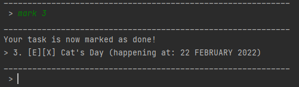

### Marking a task as incomplete : `unmark`
Marks a task in the task list as shown in [`list`](#listing-all-tasks--list) as incomplete.
#### Format: `unmark <TASK NUMBER>`
- Note that `<TASK NUMBER>` must be a positive integer corresponding to a task
  as shown in the [`list`](#listing-all-tasks--list) command.
#### Example
- `unmark 2` Marks the second task in the list as incomplete (assuming there are at least 2 tasks in the list) 
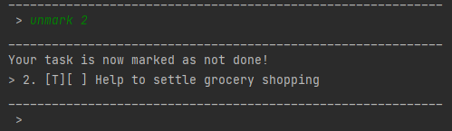

### Finding a task by searching with substring : `find`
Searches the task list for all tasks with descriptions that contain a specified substring.
#### Format: `find <SUBSTRING>`
- Note that the substring to search with is **case-sensitive**,
  meaning that a task named `Homework` cannot be found with `homework`.
#### Example
- `find work` Searches the entire list for tasks with descriptions containing `work`,
  a task named `Homework` would be listed in the output. 
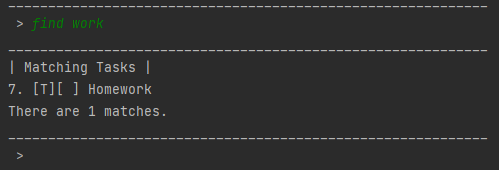

### Displaying the help menu : `help`
Shows a help menu containing a list of all available commands, their syntax and short descriptions of what they do.
#### Format: `help`
- Aliases: `?` 
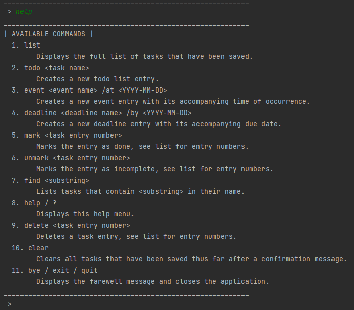

### Deleting a single task : `delete`
Deletes a task in the task list as shown in [`list`](#listing-all-tasks--list).
#### Format: `delete <TASK NUMBER>`
- Note that `<TASK NUMBER>` must be a positive integer corresponding to a task
  as shown in the [`list`](#listing-all-tasks--list) command.
- After deletion, tasks with task numbers after the deleted task in the task list would be shifted up;
  another task may take over the task number of the deleted task.
- Aliases: `remove <TASK NUMBER>`
#### Example
- `remove 5` Deletes the fifth task in the list as incomplete (assuming there are at least 5 tasks in the list) 
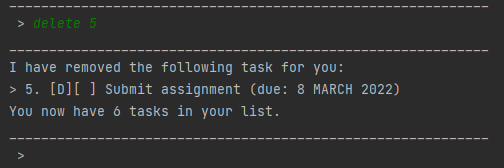

### Clearing all tasks : `clear`
Deletes all tasks that are currently in the task list after a warning message.
The tasks will only be deleted after you confirm the deletion as shown below.
#### Format: `clear`
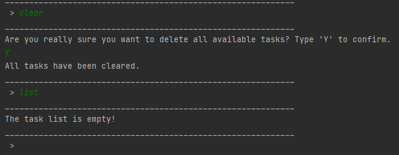

### Exiting the application : `bye`
Prints a farewell message before terminating the application and saving all changes to the save file.
#### Format: `bye`
- Aliases: `quit`, `exit`

### Saving data
Duke automatically saves all data whenever any modification is made to the task list.
There is no need to save manually.

### Loading data
Duke automatically loads a save file named `save.csv` located in the `data` folder
in the _home folder_ of the application (`[home folder]/data/save.csv`), if it exists.
Otherwise, a new save file is created and worked with.

### Editing the save file
All data from Duke is saved as a single Comma-Separated Values (CSV) file.
Advanced users are welcome to update data directly by editing the save file.
> **Caution:** If any changes were to make the format of any entries invalid,
> the entries would be ignored by the program and not be loaded.  
> **Guideline:** Check using the `list` command that edited entries are properly loaded
> before performing any commands that may edit the task list, so that affected entries are not overwritten.

---

## Command Summary

| **Command**   | **Format and Examples**                                                          |  **Aliases**   |
|:--------------|:---------------------------------------------------------------------------------|:--------------:|
| **list**      | `list`                                                                           |       -        |
| **todo**      | `todo <DESCRIPTION>`                 (e.g.`todo Do dishes`)                   |       -        |
| **event**     | `event <DESCRIPTION> /at <DATE>`     (e.g.`event Cat's Day /at 2022-02-22`)   |       -        |
| **deadline**  | `deadline <DESCRIPTION> /by <DATE>`  (e.g.`Submit assignment /by 2022-03-08`) |       -        |
| **mark**      | `mark <TASK NUMBER>`                 (e.g. `mark 3`)                          |       -        |
| **unmark**    | `unmark <TASK NUMBER>`               (e.g. `unmark 2`)                        |       -        |
| **find**      | `find <SUBSTRING>`                   (e.g. `find work`)                       |       -        |
| **help**      | `help`                                                                           |       ?        |
| **delete**    | `delete <TASK NUMBER>`               (e.g. `delete 5`)                        |    `remove`    |
| **clear**     | `clear`                                                                          |       -        |
| **bye**       | `bye`                                                                            | `quit`, `exit` |
